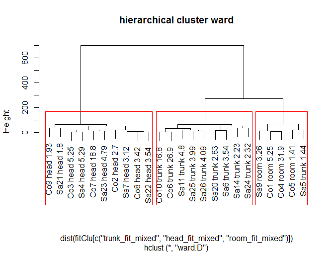
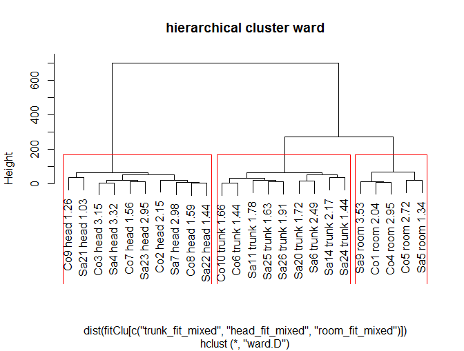
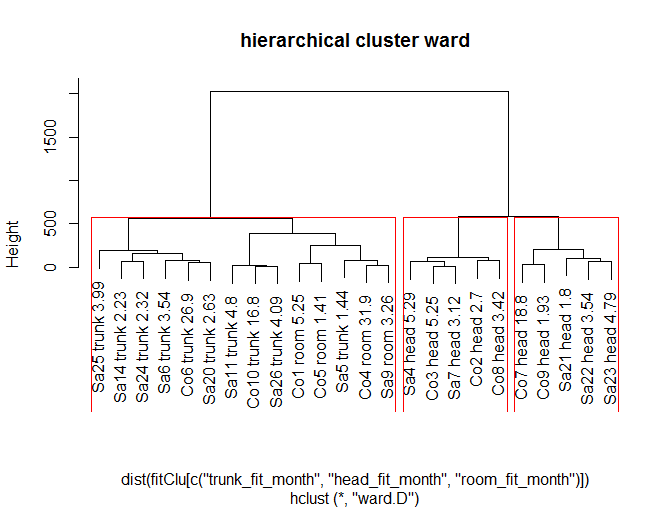
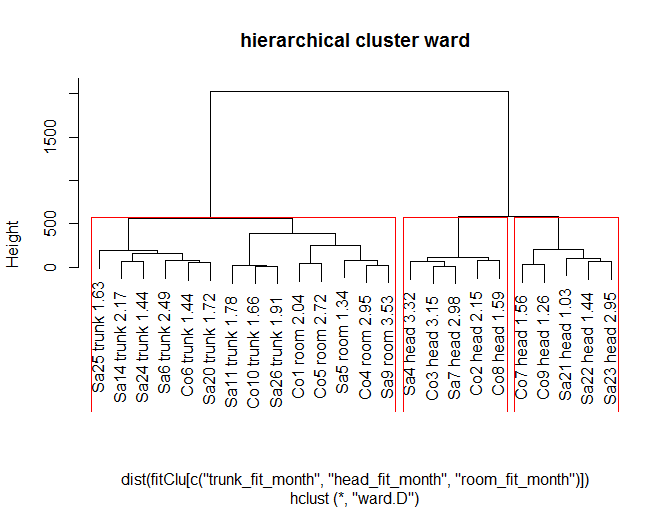
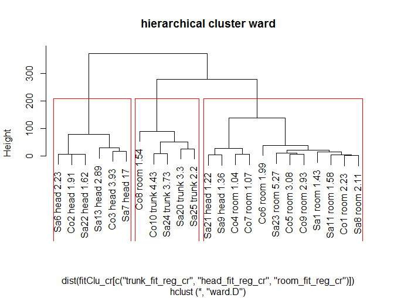
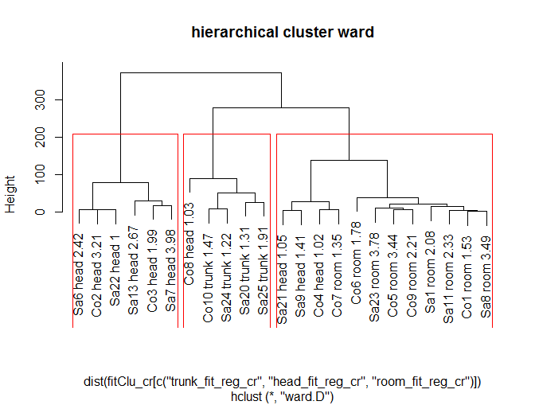
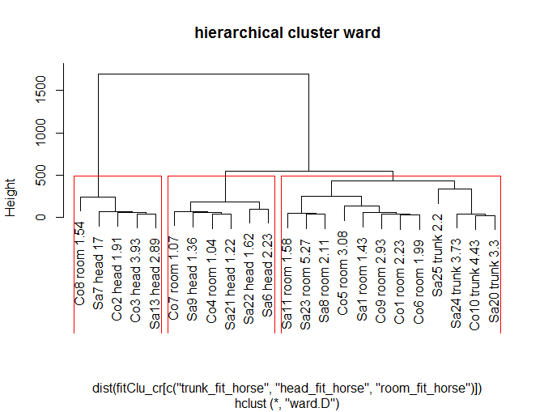
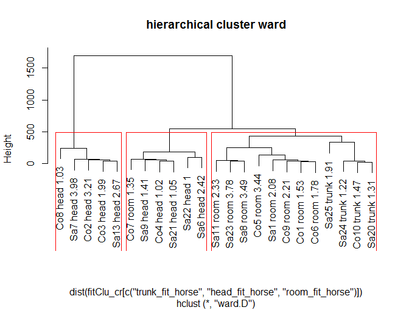
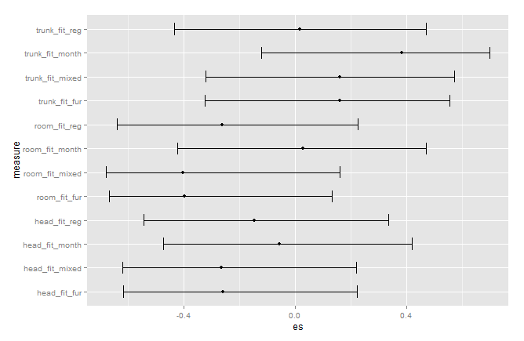
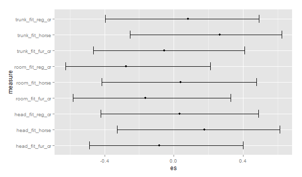

---
title: "Data Documentation"
output: html_document
---

Date: `r as.character(Sys.Date())`


### Description of files, and basic info about data
```{r setup, include=FALSE, cache=FALSE}
options(scipen=999)
```

```{r global_options, include=FALSE}
options(scipen=999)
```


```{r,echo=FALSE, message=FALSE, warning=FALSE}
#here load libraries and files for markdown code chunks
library("knitr", lib.loc="~/R/win-library/3.2")
library("ggplot2", lib.loc="~/R/win-library/3.2")

library("bootES", lib.loc="~/R/win-library/3.2")


setwd("C:/BERGEN/RStudio-Projects/Abalone")
load("data.Rda")
load("data2.Rda")
```

Pre processed data file with cleaned and formatted data from all participants: *wholedata.csv*

Summary information about the participants is in the file *participants.csv*

There are `r nrow(participantSummary)` participants, `r nrow(subset(participantSummary,type=="con"))` controls and `r nrow(subset(participantSummary,type=="syn"))` synaesthetes.

`r nrow(subset(participantSummary,type=="con" & round=="both"))` controls and `r nrow(subset(participantSummary,type=="syn" & round=="both"))` synaesthetes did both rounds. 

There are `r nrow(subset(wholedata,condition!="sys"))` datapoints (without the system and practice trials). 

Data structure is:

 - **m** : month name
 - **z** : front/back dimension - distance from Kinect device in mm
 - **X** : left/right - negative numbers on the participant's left, 0 in front of Kinect, positive numbers on the participant's right side 
 - **y**: up/down - positive up / negative down / 0 - Kinect level
 - **outlier** : coded as 0/1 where 1 means outlier
 - **condition** : straight, head turn, body turn - coded as str/hd/tr
 - **task** : month, crazy, mini
 - **type**: control, synaesthete
 - **participant** : participant code
 - **rounds**: if participant did both rounds or only one, coded as - monthsOnly, crazyOnly, both


### Outliers

**System outliers**

Outliers related to system failures (failing to record hand position properly) were removed. All points with distance from the Kinect greater than 3000mm were treated as outliers - mostly meaning that the system failed to measure hand position and measured a distance to lab room wall behind the participant. Also all trials with 0 distance were removed - as system coded 0 when failed to measure the distance at all. 

All system outlier trials are listed in the file *systemOutliers.csv*

There were `r nrow(systemOutlierCount)` system outliers, which is `r (100*nrow(systemOutlierCount)/nrow(subset(wholedata,condition!="sys")))`% of all data points. 


For experiment 1 there were 32 system outliers
For experiment 2 (wITH mini) there were 189 system outliers
For experiment 2 (WITHOUT mini) there were 141 system outliers


**IMPORTANT: For Co1 months head condition all datapoints for September are outliers. This results in missing value for this month/condition in all subsequent analyses!** 


**Standard deviation outliers**

Normal outliers were computed without "mini" task, because for each condition in mini there is only one datapoint per month/participant/condition.

For each datapoint we applied the following formula: 
- We computed average position for participant/task/condition (i.e all data points for Co2/month/hd) - measure of center of distribution in 3d space
- Then we computed average distance of datapoints from that position (measure of spread in 3d space) - we used formula for Euclidean distance in 3d space.
- Then we compared the distance of each data point to that average distance
- All points that were more than 2.5 times away from the center than the average distance were considered outliers 


```{r echo=FALSE}
numOutliers = nrow(advOutliers)
#percentageOutliers = (100*numOutliers)/numDataPoints
```

List of those data points is in the file *advOutliers.csv*

There were `r numOutliers` of them.

All these datapoints were were removed from further analysis.


### Data processing - basic summary statistics

Following summary statistics were computed:

- mean positon for each month/condition/task/participant : data in file *means.csv*
- median positon for each month/condition/task/participant : data in file *medians.csv*
- standard deviation for each month/condition/task/participant : data in file *sds.csv*
- number of valid datapoints (after outlier removal) for each month/condition/task/participant : data in file *lengths.csv* 
- average standard deviation (average of 12 separate month SD's) for each condition/task/participant : data in file *avofsds.csv*
- standard deviation of standard deviations (SD of 12 separate month SD's) for each condition/task/participant : data in file *sdofsds.csv*

Then, pooled SD's were computed for each participant/condition/task, by taking weighted average of each month SD's. The mini task was excluded, because there was only one data point per condition/month. Pooled SD data is in the file: *pooledsds.csv*

Summary of pooled SD data: 
"overall"" column is average of all the axes 

```{r echo=FALSE, results='asis'}

kable(pooledSummary, format="markdown")


```


Plot of pooled SD for each participant, averaged over conditions, and stacked by the task:

```{r echo=FALSE, fig.width=12, fig.height=5}
ggplot(sumpool,aes(x=participant,y=overall,fill=task))+geom_bar(stat="identity",position="dodge")
```


### Computing differences between conditions: straight vs. head, straight vs. trunk

Here the list of ANOVAS or t-tests.

Differences between mean position of each month/axis/condition/task/participant are in files:

*differences_z_month_str_hd.csv*
*differences_X_month_str_hd.csv*
*differences_y_month_str_hd.csv*
*differences_z_month_str_tr.csv*
*differences_X_month_str_tr.csv*
*differences_y_month_str_tr.csv*
*differences_z_crazy_str_hd.csv*
*differences_X_crazy_str_hd.csv*
*differences_y_crazy_str_hd.csv*
*differences_z_crazy_str_tr.csv*
*differences_X_crazy_str_tr.csv*
*differences_y_crazy_str_tr.csv*


Results of t-tests and effect sizes are in the file *wholeDifferenceTests.csv*

There are 141 test results.

92 have p.value<0.05

77 have p.value<0.01

56 have p.value<0.001 


### Model shift 

We computed ideal expected distribution of data for each participant assuming given reference frame. 
Three possible reference frames were modelled - head centered, trunk centered and room centered.

If participant was using room RF, data points for each month in all conditions are expected to be placed in the same positons. 

If head centered reference frame was used, participant's plot is expected to be shifted 45 deg to the right (from the plot in straight condition) in head turn trials, and remain close to straight plot in trunk turn trials. 

If trunk centered RF was used, participant's plot is expected to be shifted 45 deg to the right in trunk turn trials, and remain close to straight plot in head turn trials. 


NB: Distances between model and actual positions were computed on xz plane only. 


## 45 deg expected position - adjustments

Adjustments to the above described models can be made - some systematic noise can arise because of the difference between center of rotaion of the chair and the participant head - for trunk turn trials, and the difference between center of rotaton of the head, and participant eyes/face in head turn trials)

Therefore, **if participant was using head centered RF**: in head turn trials, ideal predicted plot should be corrected for the distance between the eyes and center of rotation of the head. 

In trunk turn trials, because of the distance between chair rotation point and participant's head, the ideal plot would not be expected at the same place as in straight condition, but offset to the left and forward. 

**If participant was using trunk centered RF**: ideal predicted plot has to be corrected for trunk turn trials, taking into account the distance between chair rotation axis and participant trunk. 
In head turn trials, the plot should be at the same place as in straight condition. 


## final model fit data
Adjusted and unadjusted model fit data were compared - using t-test for unadjusted best-fit and adjusted best-fit. There were no significant differences, therefore unadjusted algorithm was used to compute and analyze model fit  

## main table (preliminary description)
All reference frame measures for each participant are listed in the file *mainTable.csv*
The variables are (separately for month and horse tasks):

- head,trunk and room model fit
- ratio of best model fit / next to best (reversed to show how many times best fit is better than next to best fit) 
- which is best fit - head, room, or trunk
- angle of regression line - difference between angle in straight and head condition
- angle of regression line - difference between angle in straight and trunk condition
- difference between those two differences 
- furthest method angles - similarly to angles of regression lines
- model fits based on reg line angles
- "analyze_by" - which model is used in mixed analysis (some participants furthest, others reg)
- "3dplot col"" - this is necessary for 3d plot colouring - ignore in the analysis
- model fits based on furthest months 
- "rounds" - who did both crazy and month, and who only crazy or month
- fit-mixed
```{r echo=FALSE, results='asis'}

kable(mainTable, format="markdown")


```

## months - cluster analysis and model fits

Hierarchical clustering - based on mixed method. Text labels refer to which model (mixed method) fitted best.



Hierarchical clustering - based on mixed method. Text labels refer to which model (distance based method) fitted best.



Hierarchical clustering - based on distance method. Text labels refer to which model (mixed method) fitted best.



Hierarchical clustering - based on distance method. Text labels refer to which model (distance based method) fitted best.




# cluster - crazy horse

Hierarchical clustering - based on reg method. Text labels refer to which model (reg method) fitted best.



Hierarchical clustering - based on reg method. Text labels refer to which model (distance based method) fitted best.



Hierarchical clustering - based on distance method. Text labels refer to which model (reg method) fitted best.



Hierarchical clustering - based on distance method. Text labels refer to which model (distance based method) fitted best.




### Hypotheses

## MONTHS
**Testing hypothesis that preferred FoR is different for syn and for controls**

CI for effect size, pearson's r. 
This is for 10/10 (only those participants who did both month and crazy). 

```{r}
mt = subset(mainTable,rounds=="both")
bootES(data=mt,R=20000,data.col="head_fit_mixed",group.col="type",contrast=c("synaesthete","control"),effect.type="r",plot=F)
bootES(data=mt,R=20000,data.col="trunk_fit_mixed",group.col="type",contrast=c("synaesthete","control"),effect.type="r",plot=F)
bootES(data=mt,R=20000,data.col="room_fit_mixed",group.col="type",contrast=c("synaesthete","control"),effect.type="r",plot=F)

bootES(data=mt,R=20000,data.col="head_fit_month",group.col="type",contrast=c("synaesthete","control"),effect.type="r",plot=F)
bootES(data=mt,R=20000,data.col="trunk_fit_month",group.col="type",contrast=c("synaesthete","control"),effect.type="r",plot=F)
bootES(data=mt,R=20000,data.col="room_fit_month",group.col="type",contrast=c("synaesthete","control"),effect.type="r",plot=F)

bootES(data=mt,R=20000,data.col="head_fit_fur",group.col="type",contrast=c("synaesthete","control"),effect.type="r",plot=F)
bootES(data=mt,R=20000,data.col="trunk_fit_fur",group.col="type",contrast=c("synaesthete","control"),effect.type="r",plot=F)
bootES(data=mt,R=20000,data.col="room_fit_fur",group.col="type",contrast=c("synaesthete","control"),effect.type="r",plot=F)

bootES(data=mt,R=20000,data.col="head_fit_reg",group.col="type",contrast=c("synaesthete","control"),effect.type="r",plot=F)
bootES(data=mt,R=20000,data.col="trunk_fit_reg",group.col="type",contrast=c("synaesthete","control"),effect.type="r",plot=F)
bootES(data=mt,R=20000,data.col="room_fit_reg",group.col="type",contrast=c("synaesthete","control"),effect.type="r",plot=F)

```


**plot of effect sizes with CI - computed with adjusted bootstrap method, pearson r ES**
head/trunk/room + month/reg/fur/mixed

where: 

- *month* is distance based model fit
- *reg* is regression line based model fit
- *fur* is furthest month based
- *mixed* is reg for some and fur for others



```{r}

```


t-tests for 10/10 syn vs controls MONTHS

```{r}
t.test(mt$head_fit_mixed~mt$type)
t.test(mt$trunk_fit_mixed~mt$type)
t.test(mt$room_fit_mixed~mt$type)

t.test(mt$head_fit_month~mt$type)
t.test(mt$trunk_fit_month~mt$type)
t.test(mt$room_fit_month~mt$type)

t.test(mt$head_fit_fur~mt$type)
t.test(mt$trunk_fit_fur~mt$type)
t.test(mt$room_fit_fur~mt$type)

t.test(mt$head_fit_reg~mt$type)
t.test(mt$trunk_fit_reg~mt$type)
t.test(mt$room_fit_reg~mt$type)

```


## CRAZY
**Testing hypothesis that preferred FoR is different for syn and for controls**

CI for effect size, pearson's r. 
This is for 10/10 (only those participants who did both month and crazy). 

```{r}
mt = subset(mainTable,rounds=="both")
bootES(data=mt,R=20000,data.col="head_fit_horse",group.col="type",contrast=c("synaesthete","control"),effect.type="r",plot=F)
bootES(data=mt,R=20000,data.col="trunk_fit_horse",group.col="type",contrast=c("synaesthete","control"),effect.type="r",plot=F)
bootES(data=mt,R=20000,data.col="room_fit_horse",group.col="type",contrast=c("synaesthete","control"),effect.type="r",plot=F)

bootES(data=mt,R=20000,data.col="head_fit_fur_cr",group.col="type",contrast=c("synaesthete","control"),effect.type="r",plot=F)
bootES(data=mt,R=20000,data.col="trunk_fit_fur_cr",group.col="type",contrast=c("synaesthete","control"),effect.type="r",plot=F)
bootES(data=mt,R=20000,data.col="room_fit_fur_cr",group.col="type",contrast=c("synaesthete","control"),effect.type="r",plot=F)

bootES(data=mt,R=20000,data.col="head_fit_reg_cr",group.col="type",contrast=c("synaesthete","control"),effect.type="r",plot=F)
bootES(data=mt,R=20000,data.col="trunk_fit_reg_cr",group.col="type",contrast=c("synaesthete","control"),effect.type="r",plot=F)
bootES(data=mt,R=20000,data.col="room_fit_reg_cr",group.col="type",contrast=c("synaesthete","control"),effect.type="r",plot=F)


```


**plot of effect sizes with CI - computed with adjusted bootstrap method, pearson r ES**
head/trunk/room + horse/reg/fur

where: 

- *horse* is distance based model fit
- *reg* is regression line based model fit
- *fur* is furthest month based



```{r}

```


t-tests for 10/10 syn vs controls CRAZY

```{r}
t.test(mt$head_fit_horse~mt$type)
t.test(mt$trunk_fit_horse~mt$type)
t.test(mt$room_fit_horse~mt$type)

t.test(mt$head_fit_fur_cr~mt$type)
t.test(mt$trunk_fit_fur_cr~mt$type)
t.test(mt$room_fit_fur_cr~mt$type)

t.test(mt$head_fit_reg_cr~mt$type)
t.test(mt$trunk_fit_reg_cr~mt$type)
t.test(mt$room_fit_reg_cr~mt$type)

```


## crazy vs months

anova's, for each model fit separately, where:
- crazy reg lines / months mixed method = within subjects variable
- controls/synaesthetes = between subject variable


```{r}
summary(aov_trunk)

summary(aov_head)

summary(aov_room)
```


